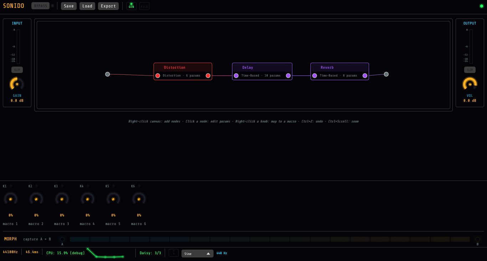
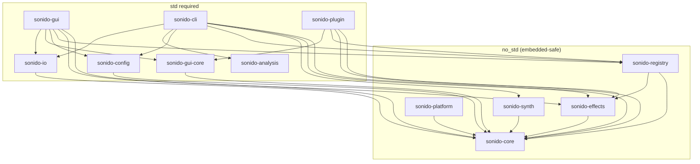

# Sonido

A three-layer DSP kernel architecture in Rust that runs identically as CLAP plugins (VST3 incoming) and on ARM (Electrosmith Daisy Seed: STM32H750, 480 MHz Cortex-M7), via a `no_std` core, a dynamic build-target adapter, a parameter bridge, and a shared DSL. `from_knobs()` maps ADC readings to parameter ranges, and `lerp()` interpolates between multi-param presets.

DAG orchestration with 36 effects, synthesis engine, spectral analysis, real-time GUI node-graph editor.

[](https://github.com/ampactor-labs/sonido/actions/workflows/ci.yml)
[](LICENSE)
[](https://doc.rust-lang.org/edition-guide/)

**[▶ Try the live browser demo](https://ampactor.dev/sonido/)**: the node-graph editor, compiled to WebAssembly.



## Quick Start

Sonido is not yet published to crates.io. Add it as a git dependency:

```toml
[dependencies]
sonido-core = { git = "https://github.com/ampactor-labs/sonido" }
sonido-effects = { git = "https://github.com/ampactor-labs/sonido" }
```

### Embedded / Bare-Metal Path

Direct kernel access, with no allocator, no smoothing overhead, and no trait objects. The kernel receives typed parameters each sample and returns audio:

```rust
use sonido_effects::kernels::{DistortionKernel, DistortionParams};
use sonido_core::kernel::DspKernel;

let mut kernel = DistortionKernel::new(48000.0);

// from_knobs() maps ADC readings → parameter ranges
let params = DistortionParams::from_knobs(
    adc_drive, adc_tone, adc_output, adc_shape, adc_mix, adc_dynamics,
);
let (out_l, out_r) = kernel.process_stereo(in_l, in_r, &params);
```

### Desktop / Plugin Path

The registry wraps every kernel in `Adapter<K, SmoothedPolicy>`, which adds per-parameter smoothing and bridges to `Effect` + `ParameterInfo`:

```rust
use sonido_registry::EffectRegistry;
use sonido_core::EffectWithParams;

let registry = EffectRegistry::new();
let mut effect = registry.create("distortion", 48000.0).unwrap();
effect.effect_set_param(0, 15.0);  // drive = 15 dB

let output = effect.process(input_sample);
```

### Effect Chaining

```rust
use sonido_registry::EffectRegistry;
use sonido_core::EffectWithParams;

let registry = EffectRegistry::new();
let mut chain: Vec<Box<dyn EffectWithParams + Send>> = vec![
    registry.create("distortion", 48000.0).unwrap(),
    registry.create("chorus", 48000.0).unwrap(),
    registry.create("reverb", 48000.0).unwrap(),
];
```

## Kernel Architecture

Every effect is implemented as a three-layer stack that separates pure DSP from parameter ownership:

```
┌─────────────────────────────────────────────────────────┐
│              Adapter<K, SmoothedPolicy>                   │
│  Bridges to Effect + ParameterInfo traits                │
│  Manages per-parameter SmoothedParam instances           │
│  Desktop / Plugin / GUI consumer                         │
├─────────────────────────────────────────────────────────┤
│                     XxxKernel                            │
│  Pure DSP state: filters, delay lines, ADAA stages       │
│  process_stereo(&mut self, l, r, &Params) → (l, r)      │
│  No parameter ownership; receives &Params each sample    │
│  Embedded / Bare-metal consumer                          │
├─────────────────────────────────────────────────────────┤
│                     XxxParams                            │
│  Typed parameter struct with indexed access               │
│  from_knobs() for ADC mapping, lerp() for morphing       │
│  from_normalized() / to_normalized() for CLAP/MIDI       │
│  Doubles as preset format, morph target, serialization   │
└─────────────────────────────────────────────────────────┘
```

On embedded, the kernel never allocates, never owns parameters, and never smooths. On a Cortex-M7, the DMA audio callback calls `kernel.process_stereo()` with parameters built directly from ADC readings. The `Adapter<K, SmoothedPolicy>` layer (smoothing, trait dispatch, boxing) exists only on desktop, where there is headroom for it.

### Anti-Aliasing

- **ADAA** (Anti-Derivative Anti-Aliasing): First-order ADAA on all nonlinear kernels (distortion, tape saturation). Reference: Parker et al., "Reducing the Aliasing of Nonlinear Waveshaping Using Continuous-Time Convolution" (DAFx-2016).
- **Oversampled\<N, E\> wrapper**: 2×/4×/8× oversampling with a 48-tap FIR filter (>80 dB stopband rejection). Wraps any `Effect`, running the inner effect at N× the base sample rate.

### Parameter Smoothing

`Adapter<K, SmoothedPolicy>` applies per-parameter smoothing based on `SmoothingStyle` declared by each `KernelParams`:

| Style | Time | Use Case |
|-------|------|----------|
| `None` | 0 ms | Stepped/enum params; snap immediately |
| `Fast` | 5 ms | Drive, nonlinear gain; fast response |
| `Standard` | 10 ms | Most continuous params (rate, depth, mix) |
| `Slow` | 20 ms | Filter coefficients, EQ bands |
| `Interpolated` | 50 ms | Delay time, predelay; glitch-free |
| `Custom(ms)` | arbitrary | Special cases |

The kernel never sees smoothing. On embedded, ADC readings are already hardware-filtered, so smoothing is skipped entirely.

### Preset Morphing

All 36 `KernelParams` implement `lerp()` for real-time preset interpolation:

```rust
let blended = DistortionParams::lerp(&clean_preset, &heavy_preset, 0.5);
// Continuous params interpolate linearly; stepped params snap at t=0.5
```

### Algorithm References

| Algorithm | Reference |
|-----------|-----------|
| Biquad filters | Robert Bristow-Johnson, "Audio EQ Cookbook" |
| Freeverb topology | Jezar's Freeverb (Schroeder-Moorer) |
| ADAA waveshaping | Parker et al., DAFx-2016 |
| PolyBLEP anti-aliasing | Välimäki et al., "Antialiasing Oscillators in Subtractive Synthesis" |
| General effects | Zölzer, "DAFX: Digital Audio Effects" |

## Embedded Deployment

Target hardware: **Electrosmith Daisy Seed** (STM32H750, Cortex-M7 @ 480 MHz, 64 MB SDRAM) and **PedalPCB Hothouse** DIY pedal platform (6 knobs, 3 toggles, stereo I/O).

`no_std` across 6 crates (`sonido-core`, `sonido-effects`, `sonido-synth`, `sonido-registry`, `sonido-platform`, `sonido-daisy`). All math via `libm`. All 36 effects provide `from_knobs()` for direct 0.0 to 1.0 ADC-to-parameter mapping.

### Morph Pedal Demo

The `sonido_pedal` firmware is the embedded demo: a 3-slot multi-effect with real-time morphing, running on the Hothouse at 48 kHz / 128 samples.

- **3 effect slots**: scroll through all 36 effects per slot via footswitch
- **Topology switching**: serial, parallel (split/merge), and fan routing, live via toggle
- **Per-node A/B editing**: capture Sound A and Sound B independently for each slot
- **Real-time morphing**: expression-ready sweep between A/B snapshots across all slots via `KernelParams::lerp()`
- **Zero-allocation audio path**: DMA callback calls `kernel.process_stereo()` directly

```bash
# Build and flash
cargo objcopy --release --example sonido_pedal --target thumbv7em-none-eabihf \
  --features alloc -- -O binary sonido_pedal.bin
dfu-util -a 0 -s 0x08000000:leave -D sonido_pedal.bin
```

### DMA Audio Callback Example

```rust
use sonido_effects::kernels::{DistortionKernel, DistortionParams};
use sonido_core::kernel::DspKernel;

static mut KERNEL: Option<DistortionKernel> = None;

fn audio_callback(left_in: &[f32], right_in: &[f32],
                  left_out: &mut [f32], right_out: &mut [f32]) {
    let kernel = unsafe { KERNEL.as_mut().unwrap() };

    // Read ADC knobs once per block (drive, tone, output, shape, mix, dynamics)
    let params = DistortionParams::from_knobs(
        read_adc(0), read_adc(1), read_adc(2), read_adc(3), read_adc(4), read_adc(5),
    );

    // Block processing: no allocation, no trait dispatch
    kernel.process_block_stereo(left_in, right_in, left_out, right_out, &params);
}
```

The `PlatformController` trait and `ControlMapper` in `sonido-platform` provide a structured abstraction for mapping hardware controls (knobs, toggles, expression pedals) to kernel parameters. See [docs/EMBEDDED.md](docs/EMBEDDED.md) for hardware integration details.

## Effects (36)

> [docs/DSP_MEASUREMENTS.md](docs/DSP_MEASUREMENTS.md) reports reproducible THD-vs-drive, harmonic structure, and reverb RT60 figures, generated by `cargo run --release --example dsp_report -p sonido-effects` through the in-repo FFT/THD tooling.

| Effect | Category | True Stereo | Key Parameters |
|--------|----------|:-----------:|----------------|
| Preamp | Utility | x | gain, tone |
| Distortion | Distortion | | drive, tone, mode (Soft Clip / Hard Clip / Foldback / Asymmetric) |
| Tape Saturation | Distortion | | drive, warmth, wow, flutter, head bump |
| Bitcrusher | Distortion | x | bit depth, sample rate reduction |
| Compressor | Dynamics | | threshold, ratio, attack, release, knee, mix |
| Limiter | Dynamics | x | threshold, release |
| Gate | Dynamics | | threshold, attack, release, hold |
| Multiband Compressor | Dynamics | | low/mid/high thresholds, ratios, crossover frequencies |
| De-esser | Dynamics | | threshold, frequency, ratio |
| Transient Shaper | Dynamics | | attack gain, sustain gain, speed |
| Chorus | Modulation | x | rate, depth, mix, voices |
| Flanger | Modulation | x | rate, depth, feedback, mix |
| Phaser | Modulation | x | rate, depth, stages, feedback |
| Tremolo | Modulation | x | rate, depth, waveform, stereo spread |
| Vibrato | Modulation | | depth, mix, output |
| Ring Modulator | Modulation | x | frequency, mix |
| Wah | Filter | | frequency, resonance, mode (Auto / Manual) |
| Filter | Filter | | cutoff, resonance (resonant biquad lowpass) |
| Parametric EQ | Filter | | 3-band frequency, gain, Q |
| Shelving EQ | Filter | | low shelf freq/gain, high shelf freq/gain |
| Delay | Time-Based | x | time, feedback, mix, ping-pong, diffusion |
| Reverb | Time-Based | x | room size, damping, width, mix |
| Harmonic Habitat | Time-Based | x | room size, harmonicity, tracking, memory, mode |
| Plate Reverb | Time-Based | x | decay, diffusion, mix |
| Spring Reverb | Time-Based | | tension, decay, mix |
| Time Stretch | Time-Based | | ratio, mix |
| Pitch Shift | Pitch | x | semitones, mix |
| Amp | Distortion | | drive, tone, cabinet |
| Cabinet | Utility | x | model |
| Stereo Widener | Utility | x | width, mono bass cutoff |
| Drone | Synthesis | | root, mode, volume |
| Glitch | Modulation | x | rate, depth, size |
| Texture | Modulation | x | density, size, mix |
| Tuner | Utility | | reference pitch |
| Stage | Utility | x | phase invert, DC block, bass mono, width, Haas delay, output |
| Looper | Utility | x | length, overdub, speed |

**Categories**: Distortion (4), Dynamics (6), Modulation (9), Filter (4), Time-Based (5), Pitch (1), Utility (5), Synthesis (1).

## Processing Graph

DAG-based audio routing via `ProcessingGraph` and `GraphEngine`:

```rust
use sonido_core::graph::ProcessingGraph;

// Linear chain
let mut graph = ProcessingGraph::linear(effects, 48000.0, 256)?;
graph.process_block(&left_in, &right_in, &mut left_out, &mut right_out);

// Arbitrary DAG: parallel paths with split/merge
let mut graph = ProcessingGraph::new(48000.0, 256);
let input = graph.add_input();
let split = graph.add_split();
let a = graph.add_effect(distortion);
let b = graph.add_effect(reverb);
let merge = graph.add_merge();
let output = graph.add_output();

graph.connect(input, split)?;
graph.connect(split, a)?;
graph.connect(split, b)?;
graph.connect(a, merge)?;
graph.connect(b, merge)?;
graph.connect(merge, output)?;
graph.compile()?;  // Kahn sort → liveness analysis → latency compensation
```

- **Buffer liveness analysis**: minimizes memory, so a 20-node chain uses only 2 buffers
- **Latency compensation**: Auto-inserts delay lines on shorter parallel paths
- **Atomic schedule swap**: Compiled schedules swap via `Arc` with ~5ms crossfade (click-free)
- **Graph DSL**: `"preamp:gain=6 | distortion:drive=15 | reverb:mix=0.3"`
- **Parallel split**: `"split(distortion:drive=20; -) | limiter"` (dry path via `-`)
- **Fan topology**: `"split(chorus; reverb; delay)"` (one input fans to three independent outputs)

## Architecture



| Crate | Purpose | no_std |
|-------|---------|--------|
| `sonido-core` | Effect trait, DspKernel/KernelParams/Adapter, parameters, delays, filters, LFOs, tempo, DAG processing graph | Yes |
| `sonido-effects` | 36 effects via DspKernel + Adapter architecture | Yes |
| `sonido-synth` | PolyBLEP oscillators, ADSR envelopes, voice management, modulation matrix | Yes |
| `sonido-registry` | Effect factory and discovery by name/category | Yes |
| `sonido-platform` | Hardware abstraction: PlatformController, ControlMapper | Yes |
| `sonido-analysis` | FFT, spectral analysis, adaptive filters, resampling | No |
| `sonido-config` | Preset and chain configuration management | No |
| `sonido-io` | WAV I/O, real-time audio streaming via cpal | No |
| `sonido-gui-core` | Shared GUI widgets, theme, ParamBridge trait | No |
| `sonido-gui` | egui node-graph editor: macros, A/B morph, session save/load, CLAP/pedal export | No |
| `sonido-cli` | Command-line processor and analyzer | No |
| `sonido-plugin` | CLAP plugin adapter with embedded GUI | No |

## CLAP Plugins

Sonido builds **20 single-effect CLAP plugins** plus a **graph-player** plugin that hosts any rig exported from the GUI. Each has an embedded egui GUI. Compatible with Bitwig, Reaper, Ardour, and any CLAP-compatible DAW. **VST3/AU** are produced from the same CLAP source via [`clap-wrapper`](https://github.com/free-audio/clap-wrapper) (external build step).

```bash
# Build and install all plugins to ~/.clap/ (Linux)
make plugins

# Or package loadable .clap bundles for any target (macOS bundles, Windows DLLs, CI):
scripts/bundle-clap.sh            # -> dist-clap/
```

Tagged releases ship pre-built `.clap` bundles for Linux, macOS (x64 + arm64), and Windows via the release workflow.

Single-effect plugins: `sonido-preamp`, `sonido-distortion`, `sonido-compressor`, `sonido-gate`, `sonido-eq`, `sonido-wah`, `sonido-chorus`, `sonido-flanger`, `sonido-phaser`, `sonido-tremolo`, `sonido-delay`, `sonido-filter`, `sonido-vibrato`, `sonido-tape`, `sonido-reverb`, `sonido-harmonic-habitat`, `sonido-limiter`, `sonido-bitcrusher`, `sonido-ringmod`, `sonido-stage`.

Graph plugin: `sonido-graph-player` loads `.sonidopatch.json` rigs authored and exported from the GUI (**Export ▸ Export as CLAP patch**), so a whole multi-effect graph runs as one plugin.

## Synthesis Engine

PolyBLEP-antialiased oscillators (sine, saw, square, triangle), ADSR envelopes with configurable curves, polyphonic voice management with voice stealing, and a modulation matrix for flexible source→destination routing.

```rust
use sonido_synth::{PolyphonicSynth, OscillatorWaveform};

let mut synth: PolyphonicSynth<8> = PolyphonicSynth::new(48000.0);
synth.set_osc1_waveform(OscillatorWaveform::Saw);
synth.note_on(60, 100);  // MIDI note C4, velocity 100
let sample = synth.process();
```

See [docs/SYNTHESIS.md](docs/SYNTHESIS.md) for the full synthesis guide.

## CLI

12 commands for processing, analysis, and real-time audio:

```bash
# Install
cargo install --path crates/sonido-cli

# Process audio
sonido process input.wav --effect distortion --param drive=15
sonido process input.wav --chain "preamp:gain=6|distortion:drive=12|delay:time=300"
sonido process input.wav --preset presets/guitar_crunch.toml

# Parallel split routing via graph DSL
sonido process input.wav --chain "split(distortion:drive=20; -) | limiter"

# Real-time processing (live mic input)
sonido realtime --effect chorus --param rate=2 --param depth=0.6

# Generate test signals
sonido generate sweep sweep.wav --start 20 --end 20000 --duration 3.0
sonido generate tone tone.wav --freq 440 --duration 2.0
sonido generate noise noise.wav --duration 1.0 --amplitude 0.5

# Analyze audio
sonido analyze spectrum recording.wav --fft-size 4096 --peaks 10
sonido analyze transfer dry.wav wet.wav --output response.json
sonido analyze ir sweep.wav recorded.wav --output ir.wav

# List effects and devices
sonido effects
sonido devices
```

## GUI

```bash
cargo run -p sonido-gui --release
```

A node-graph editor for building DAG effect rigs, with:

- **Visual routing**: right-click to add nodes from a searchable palette; new nodes splice into the nearest wire; the layout auto-arranges left→right by signal-flow depth.
- **Per-effect controls**: parameter-scale-aware knobs (log for frequency, snap for stepped) with real-time input/output metering and per-node activity.
- **Six performance macros (K1-K6)**: right-click any knob to map it to a macro; one macro sweeps every parameter it drives, with per-mapping range/curve and invert.
- **A/B morph**: capture two snapshots of the whole rig and crossfade between them (curve-aware per parameter); lock individual effects out of the morph.
- **Session save/load**: the full editor state (topology, params, A/B snapshots, macros, morph) round-trips through a versioned JSON session.
- **Undo/redo**: `Ctrl+Z` / `Ctrl+Shift+Z` for structural edits.
- **Export**: project the rig to a canonical patch and export it as a CLAP plugin preset, a portable JSON patch, a Daisy pedal `.bin` sector, or flash it straight to the pedal over DFU (pedal targets are validated against the device's effect/CPU/SDRAM budget first).

Built on a lock-free atomic parameter bridge (wait-free audio-thread reads) and a dark CRT-phosphor theme. Also builds to `wasm32-unknown-unknown` via Trunk for browser-based demos.

## Performance

Even on a 2015 mobile CPU (Intel Core i5-6300U @ 3.0 GHz turbo), every effect runs comfortably within the real-time budget. A representative sample at 256-sample blocks, 48 kHz:

| Effect | µs/block | ns/sample | CPU % (mono) |
|--------|----------|-----------|:------------:|
| Preamp | 2.47 | 9.6 | 0.05% |
| Filter | 3.69 | 14.4 | 0.07% |
| Delay | 5.49 | 21.4 | 0.10% |
| Tape Saturation | 6.88 | 26.9 | 0.13% |
| Chorus | 22.80 | 89.1 | 0.43% |
| Distortion | 28.08 | 109.7 | 0.53% |
| Reverb | 49.22 | 192.3 | 0.92% |

CPU % is `ns_per_sample / (1e9 / 48000) × 100`. The full per-effect table and methodology live in [docs/BENCHMARKS.md](docs/BENCHMARKS.md); reproduce with `cargo bench`. Embedded ARM benchmarks are pending (see [docs/EMBEDDED.md](docs/EMBEDDED.md) for memory budgets).

## Testing

1,800+ tests across the workspace:

- **Golden file regression**: Effect output compared against reference WAV files (MSE < 1e-6, SNR > 60 dB, spectral correlation > 0.9999)
- **Property-based testing**: Proptest verifies bounded output and reset behavior for all 36 effects
- **no_std verification**: 5 core crates tested without default features
- **Doc tests**: All rustdoc examples compile and run
- **Algorithm citations**: Every DSP implementation traces to a published reference (Bristow-Johnson Audio EQ Cookbook, Parker et al. DAFx-2016, Jezar Freeverb, Välimäki PolyBLEP, Zölzer DAFX)
- **CI**: every push and PR runs fmt, clippy, test, and a wasm build (`ci.yml`); a manual workflow (`ci-manual.yml`) adds no_std verification, benchmarks, coverage, and plugin validation

```bash
cargo test                          # Full workspace
cargo test -p sonido-effects        # Single crate
cargo test --no-default-features -p sonido-core  # no_std
```

## Audio Demos

Demo files are generated locally, not checked into the repo:

```bash
./scripts/generate_demos.sh
```

This produces source tones (sine, sawtooth chord, percussive hit, sweep) and processed versions through each effect and a full 5-effect chain.

## Documentation

### Design & Theory
- [DSP Fundamentals](docs/DSP_FUNDAMENTALS.md): signal processing theory behind the implementations
- [Design Decisions](docs/DESIGN_DECISIONS.md): architecture decision records
- [Architecture Overview](docs/ARCHITECTURE.md): crate structure and data flow
- [DSP Quality Standard](docs/DSP_QUALITY_STANDARD.md): measurement protocol and compliance

### User Guides
- [Getting Started](docs/GETTING_STARTED.md)
- [CLI Guide](docs/CLI_GUIDE.md)
- [Effects Reference](docs/EFFECTS_REFERENCE.md)
- [Synthesis Guide](docs/SYNTHESIS.md)
- [GUI Documentation](docs/GUI.md)
- [Embedded Guide](docs/EMBEDDED.md)

### Reference
- [Biosignal Analysis](docs/reference/biosignal.md): EEG/biosignal processing
- [CFC Analysis](docs/reference/cfc-analysis.md): cross-frequency coupling
- [Hendrix Effects](docs/reference/hendrix-effects.md): implementation brief
- [Hendrix Signal Chain](docs/reference/hendrix-signal-chain.md): reference chain
- [Signature Sounds](docs/reference/signature-sounds.md): creative DSP brainstorming

### Development
- [Contributing](docs/CONTRIBUTING.md)
- [Testing](docs/TESTING.md)
- [Benchmarks](docs/BENCHMARKS.md)
- [Changelog](docs/CHANGELOG.md)
- [Roadmap](docs/ROADMAP.md): current state, near-term priorities, and capability horizons

## License

Sonido is **dual-licensed**: open-source under [AGPL-3.0-or-later](LICENSE), or a separate [commercial license](LICENSING.md) for shipping closed-source products (DAW plugins, hardware, proprietary apps) without the copyleft obligation. See [LICENSING.md](LICENSING.md) for details and contact.
