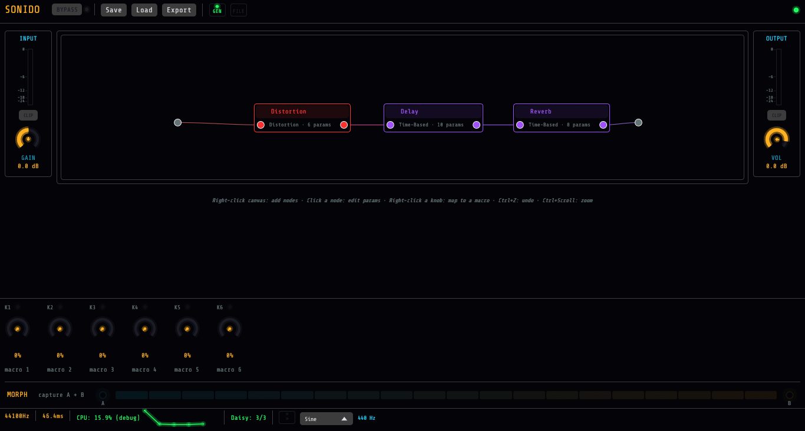

# sonido

[](https://github.com/ampactor-labs/sonido/actions/workflows/ci.yml)
[](LICENSE)

A Rust framework for audio signal processing whose effect kernels run unchanged in CLAP plugins, a browser node-graph editor and guitar-pedal firmware. CLAP is an open plugin format for audio workstations; the pedal is an Electrosmith Daisy Seed (a 480 MHz Cortex-M7) in a Hothouse enclosure. The 36 effects are kernels that allocate and smooth nothing while processing; the pedal wraps them in an adapter that applies knob values at once, desktop in one that smooths them. The distortion on the pedal is the distortion in the plugin.

**Status: working.** The API may change; nothing is published to crates.io, so the git dependency under Usage is the only install, and the ARM firmware is built and checked by flashing it by hand, since CI does not build it.

Live: https://ampactor.dev/sonido/



## Quick start

The editor runs in the browser with nothing to install: https://ampactor.dev/sonido/ (CI rebuilds it from `main`). Building locally needs Rust 1.85 or later (the workspace uses edition 2024); on Linux the GUI, the CLI and the workspace tests also need the ALSA and X11 development packages listed under `SYSTEM_DEPS` in [.github/workflows/ci.yml](.github/workflows/ci.yml).

```sh
git clone https://github.com/ampactor-labs/sonido
cd sonido
cargo run -p sonido-effects --example chain_demo   # prints two effect chains; needs no audio device
cargo run -p sonido-gui --release                  # the node-graph editor, native
```

On the command line, generate a tone, list the effects, and run the tone through a distortion:

```sh
cargo run -p sonido-cli -- generate tone tone.wav --freq 220 --duration 2
cargo run -p sonido-cli -- effects
cargo run -p sonido-cli -- process tone.wav out.wav --effect distortion --param drive=15
```

## Usage

```toml
[dependencies]
sonido-core = { git = "https://github.com/ampactor-labs/sonido" }
sonido-effects = { git = "https://github.com/ampactor-labs/sonido" }
```

Both crates default to their `std` feature; an embedded build adds `default-features = false`.

The first block calls the kernel directly, as firmware can. `from_knobs` takes six readings between 0 and 1, as an ADC (analog-to-digital converter) delivers them; parameters arrive by reference on every call and the kernel holds only its DSP (digital signal processing) state:

```rust
use sonido_core::kernel::DspKernel;
use sonido_effects::kernels::{DistortionKernel, DistortionParams};

let mut kernel = DistortionKernel::new(48_000.0);
let params = DistortionParams::from_knobs(
    adc_drive, adc_tone, adc_output, adc_shape, adc_mix, adc_dynamics,
);
let (out_l, out_r) = kernel.process_stereo(in_l, in_r, &params);
```

The second block is the desktop path: the registry wraps the same kernel in `Adapter<K, SmoothedPolicy>`, which owns per-parameter smoothing and implements the dynamic effect interface; parameter 0 of the distortion is drive in dB:

```rust
use sonido_registry::EffectRegistry;

let registry = EffectRegistry::new();
let mut effect = registry.create("distortion", 48_000.0).unwrap(); // Box<dyn EffectWithParams + Send>
effect.effect_set_param(0, 15.0); // drive, dB
let output = effect.process(input_sample);
```

Both blocks compile against this commit (checked by hand on 2026-09-27); CI does not compile them, see Testing.

## How it works

Every effect is three layers; the third differs by target:

```
XxxParams            typed params; from_knobs(), lerp(), from_normalized()
    │
XxxKernel            pure DSP; process_stereo(l, r, &Params) -> (l, r)
    │                no allocation in the audio path, no parameter ownership, no smoothing
Adapter<K, Policy>   SmoothedPolicy on desktop: per-parameter smoothing, 5 to 50 ms ramps by parameter
                     DirectPolicy on the pedal: zero-sized, a knob value is live on the next call
```

The kernel is the part every target shares. On the pedal, per-sample smoothing would duplicate what the ADC's analog filtering and the control task's own smoothing already do, so the firmware wraps each kernel in `Adapter<K, DirectPolicy>` (`crates/sonido-daisy/examples/sonido_pedal.rs`). `XxxParams` doubles as the preset format, which is why morphing between presets is `lerp()` and nothing more.

The distortion, tape and amp kernels use first-order ADAA (antiderivative anti-aliasing, Parker et al., DAFx-2016), which cuts the aliasing that waveshaping creates without oversampling; filters use the RBJ Audio EQ Cookbook formulas; the reverb is an 8-line feedback delay network with a Hadamard mixing matrix (Jot and Chaigne 1991, Dattorro 1997) on Freeverb's delay tunings. `sonido-core` also ships `Oversampled<N>` (2x, 4x, 8x) with a 48-tap Kaiser-windowed sinc downsampling filter, raised from 16 taps to clear 80 dB of stopband attenuation (`crates/sonido-core/src/oversample.rs`), but no shipping path applies it: the registry, plugins, editor and firmware run every kernel at base rate, and only the bench and the core tests exercise the wrapper.

A rig is a directed acyclic graph (DAG): effects are nodes and audio connections are edges, so parallel legs and merges are ordinary topology. `ProcessingGraph` compiles a rig with Kahn's topological sort and buffer liveness analysis (`crates/sonido-core/src/graph/processing.rs`), so a 20-node linear chain runs on two ping-ponged buffers instead of twenty (`crates/sonido-core/src/graph/buffer.rs`). The same topology is scriptable through `sonido-graph-dsl`, with `split(...)` for parallel legs: `split(distortion:drive=20 | chorus; phaser | flanger) | reverb`.

Longer write-ups: [docs/KERNEL_ARCHITECTURE.md](docs/KERNEL_ARCHITECTURE.md) (the three layers), [docs/ARCHITECTURE.md](docs/ARCHITECTURE.md) (the crate graph and data flow), [docs/DESIGN_DECISIONS.md](docs/DESIGN_DECISIONS.md) (30 architecture decision records), [docs/EMBEDDED.md](docs/EMBEDDED.md) (Daisy hardware, memory budgets, flashing over USB DFU, the device firmware update protocol), [docs/EFFECTS_REFERENCE.md](docs/EFFECTS_REFERENCE.md) (all 36 effects and their parameters), [docs/GETTING_STARTED.md](docs/GETTING_STARTED.md) (library, CLI, GUI and WebAssembly walkthroughs).

## Benchmarks

Per-effect cost on an Intel i5-6300U at 3.0 GHz turbo, from [docs/BENCHMARKS.md](docs/BENCHMARKS.md): a generated test signal in 256-sample mono blocks at 48 kHz through `Adapter<K, SmoothedPolicy>` at the "typical" parameter values listed there, timed with the criterion harness. Reproduce with `cargo bench -p sonido-effects`. The five most expensive measured effects, then the cheapest for scale:

| Effect | 256 samples | ns/sample | One core at 48 kHz |
|---|---|---|---|
| Vibrato | 113.43 µs | 443.1 | 2.1% |
| Eq (3-band) | 113.06 µs | 441.6 | 2.1% |
| Compressor | 80.02 µs | 312.6 | 1.5% |
| Phaser (6-stage) | 78.25 µs | 305.6 | 1.5% |
| Reverb | 49.22 µs | 192.3 | 0.92% |
| CleanPreamp | 2.47 µs | 9.6 | 0.05% |

The bench covers 19 of the 36 effects. The document records numbers for 15 of them and lists Limiter, Bitcrusher, RingMod and Stage as TBD; the other 17 effects have no benchmark. So the claim is the narrow one: each of the fifteen measured effects takes at most 2.1% of one core at 48 kHz on that laptop chip. Where it costs more: true-stereo processing runs 1.5 to 1.8 times the mono cost per channel for Flanger, Delay, Reverb and Phaser (Chorus is the exception at 0.65), and 8x oversampling of the distortion costs 6.14 times the base rate against 1.52 for 4x. The stereo and oversampling tables are in the same file.

The Cortex-M7 figures in that file are estimates derived from the desktop numbers: ns/sample multiplied by 25 (a 3.0/0.48 GHz clock ratio times a 4x architecture penalty) with a stated uncertainty of ±50%. Under that model Eq lands at 110.4% and Vibrato at 110.8% of the 48 kHz budget on their own. No on-device number exists yet (see Limitations).

### Sound quality

Measured by in-repo tooling at 48 kHz through a 16384-point fast Fourier transform (FFT) with a Blackman-Harris window, and regenerated by `cargo run --release --example dsp_report -p sonido-effects`, which rewrites [docs/DSP_MEASUREMENTS.md](docs/DSP_MEASUREMENTS.md) and the spectrum plot beside it; the run is deterministic.

- Distortion THD (total harmonic distortion) tracks drive on a 1 kHz tone: 13.19% at 10 dB, 33.37% at 20 dB, 41.43% at 30 dB, 43.20% at 40 dB.
- The soft-clip curve is odd-symmetric, as the theory says it should be: at 30 dB drive the third harmonic sits at −9.6 dB relative to the fundamental and the fifth at −14.5 dB, while every even harmonic stays below −114 dB.
- Reverb decay is an RT60 (the time for the tail to fall 60 dB, by Schroeder backward integration) of 3.50 s measured from the kernel's output, with a fit correlation of 0.998.

## Project layout

```
crates/
  sonido-core        DSP primitives, DspKernel and Adapter, Oversampled, the DAG graph engine   no_std
  sonido-effects     the 36 kernels and their parameter structs                                no_std
  sonido-registry    create-by-id factory; wraps each kernel in an Adapter                     no_std
  sonido-synth       PolyBLEP (band-limited) oscillators, envelopes, voices                    no_std
  sonido-platform    hardware control abstractions (knobs, toggles, MIDI)                      no_std
  sonido-patch       the patch format: JSON, binary sector, runtime                            no_std
  sonido-daisy       Daisy Seed firmware and the pedal examples; outside the workspace         no_std
  sonido-analysis    FFT, THD, RT60 and other offline analysis
  sonido-io          WAV files and cpal (cross-platform audio) streams
  sonido-config      presets and chain configuration
  sonido-graph-dsl   the text rig format and its builder
  sonido-gui-core    shared egui (GUI toolkit) widgets, theme, parameter bridge
  sonido-gui         the node-graph editor, native and WebAssembly (wasm32)
  sonido-cli         the `sonido` command
  sonido-plugin      the CLAP adapter; each plugin is an example
docs/                guides, measurements, decision records
presets/             five factory preset chains (TOML)
scripts/             bundle-clap.sh, bundle-vst3.sh, demo and QA scripts
```

Fifteen crates: fourteen are workspace members, and `sonido-daisy` is excluded because its own `.cargo/config.toml` pins the build to `thumbv7em-none-eabihf`. Seven build without the standard library: six carry `#![cfg_attr(not(feature = "std"), no_std)]` and `sonido-daisy` is `#![no_std]` outright; math goes through `libm`. The applications on top:

- CLI, 12 subcommands (`process`, `realtime`, `generate`, `analyze`, `compare`, `devices`, `effects`, `info`, `play`, `presets`, `daisy`, `patch`): offline processing through a chain or graph string, live input, signal generation, spectrum and impulse-response analysis. `cargo install --path crates/sonido-cli`.
- GUI (`cargo run -p sonido-gui --release`): the node editor with six macro knobs, whole-rig A/B morph, undo, and export to a CLAP preset, a JSON patch, a pedal binary sector or a DFU flash.
- Plugins: 21 CLAP plugins built as examples of `sonido-plugin`, 20 single-effect plus `sonido-graph-player`, which runs a whole exported rig as one plugin. `make plugins` installs them to `~/.clap/`.
- Pedal firmware: `sonido_pedal` for the Cleveland Music Co. Hothouse: three slots drawn from eight effects (`PEDAL_EFFECT_IDS`), three topologies (linear, parallel, fan) selected with a toggle, 48 kHz in 32-sample blocks (`BLOCK_SIZE` in `crates/sonido-daisy/src/lib.rs`).

## Deploy

The web editor deploys from [.github/workflows/pages.yml](.github/workflows/pages.yml): on a push to `main` that touches `crates/**` (or a manual dispatch) it runs `trunk build --release --public-url /sonido/` (trunk is the WebAssembly bundler) in `crates/sonido-gui` and publishes `dist/` to GitHub Pages at https://ampactor.dev/sonido/.

Releases come from [.github/workflows/release.yml](.github/workflows/release.yml) on a `v*` tag: it builds the CLI, the GUI, the CLAP bundles (`scripts/bundle-clap.sh`) and the VST3 shims (`scripts/bundle-vst3.sh`, clap-wrapper v0.15.1; VST3 is Steinberg's plugin format) for linux-x64, macos-x64, macos-arm64 and windows-x64, exports the factory presets, and attaches one archive per target to a GitHub release. v0.1.0 (2026-07-20) is the one release so far, with those four archives; the VST3 shims joined the workflow after it.

## Testing

```sh
cargo test --workspace                           # what CI runs; on Linux it needs the SYSTEM_DEPS packages
cargo test -p sonido-core                        # 484 unit, 27 integration, 4 property tests, 58 doctests
cargo test -p sonido-effects                     # 360 unit tests plus 126 across nine integration targets
cargo test --no-default-features -p sonido-core  # the no_std build
```

There are 1,899 `#[test]` functions in the tree (`grep -rho '#\[test\]' crates | wc -l`, 2026-09-27), 1,864 outside the excluded ARM crate, and no `#[ignore]`. The shape of the suite says more than the count:

- Golden-file regression pins the output of 32 of the 36 effects against checked-in references and fails on a mean squared error (MSE) above 1e-6, a signal-to-noise ratio (SNR) below 60 dB or a spectral correlation under 0.9999, each threshold explained next to the constant that sets it (`crates/sonido-effects/tests/regression.rs`). Drone, glitch, texture and time_stretch have no golden file.
- An aliasing suite fails the distortion, preamp, amp and tape kernels when inharmonic energy exceeds 5% of the total, which is what ADAA is supposed to buy (`crates/sonido-effects/tests/aliasing.rs`).
- Property tests (proptest) push every registered effect through random parameter sets and require finite, bounded output and a clean reset; the core primitives get stability and convergence properties, and the patch format gets lossless round-trips and a decoder that never panics on random bytes.
- The registry asserts its own inventory, which is where the number 36 in this README comes from (`crates/sonido-registry/src/lib.rs`).

On every push and pull request to `main`, [.github/workflows/ci.yml](.github/workflows/ci.yml) runs `cargo fmt --all --check`, `cargo clippy --workspace --all-targets` with `RUSTFLAGS=-D warnings`, `cargo test --workspace` on Ubuntu, macOS and Windows, and a `wasm32-unknown-unknown` build of the editor. Behind `workflow_dispatch`, [.github/workflows/ci-manual.yml](.github/workflows/ci-manual.yml) adds `--no-default-features` tests for the six `no_std` crates, `cargo doc` with warnings denied, the cargo-deny dependency policy, criterion benchmarks compared with critcmp, llvm-cov coverage, and the CLAP conformance checker clap-validator 0.3.2 over every bundled plugin.

Not tested: the ARM path (`sonido-daisy` is outside the workspace, no workflow targets `thumbv7em-none-eabihf`, and its 35 tests never run in CI; I verify the firmware by flashing it and listening); the VST3 shims (no workflow runs Steinberg's validator; `docs/CHANGELOG.md` records one run by hand); the two Usage blocks above (no doctest includes them); and performance, because the benchmark job uploads a comparison for a human to read and fails nothing.

## Limitations

The on-device numbers have not been measured. [docs/BENCHMARKS.md](docs/BENCHMARKS.md) estimates Cortex-M7 cost by multiplying desktop measurements by 25 (a 3.0/0.48 GHz clock ratio times a 4x architecture penalty) and states its own uncertainty at ±50%; under that model the 3-band Eq lands at 110.4% of the 48 kHz budget and Vibrato at 110.8%, so neither fits alone. The measurement would come from the firmware crate's kernel benchmark example, which reads the Cortex-M7's DWT cycle counter (a hardware counter of clock cycles) around one 32-sample block per kernel and prints each result against the 320,000-cycle block budget over USB serial; it has to be flashed to a Hothouse, which no CI runner can do. Until that table exists, every ARM performance statement in this repository is a hypothesis.

Two effects blow the memory budget. AXI SRAM, the chip's main working memory, is 512 KB, about 480 KB of it usable once the bootloader has copied the firmware into it (BOOT_SRAM mode). The delay's two-second stereo lines cost about 772 KB and the looper's sixty-second buffer about 23 MB, so both must live in the external SDRAM, where every access costs 4 to 8 wait states. Restricted to the effects that fit AXI, the worst three-slot combination (chorus, reverb and tape) is about 144 KB. Per-effect heap is measured from kernel `new()` allocations in [docs/EMBEDDED.md](docs/EMBEDDED.md).

The other gaps:

- The ARM target is not in CI. `sonido-daisy` is excluded from the workspace and no workflow targets `thumbv7em-none-eabihf`; I check the pedal firmware and the benchmark harness (`crates/sonido-daisy/examples/bench_kernels.rs`) only by flashing them on my desk.
- The pedal firmware exposes 8 of the 36 effects (`PEDAL_EFFECT_IDS` in `crates/sonido-registry/src/lib.rs`).
- No shipping path oversamples. Aliasing control rests on ADAA in the distortion, tape and amp kernels, and the aliasing suite measures only those three plus the preamp; no other kernel is measured for aliasing.
- VST3 is unvalidated in CI. The shims come from clap-wrapper (`scripts/bundle-vst3.sh`) and only clap-validator runs in a workflow, so only CLAP has a validation record.
- 17 of the 36 effects have no benchmark, and 4 have no golden regression file.
- No crates.io release, no pinned MSRV (minimum supported Rust version), and the benchmark job has no regression gate.
- The browser build has no file system: presets stay in memory, the export menu downloads the JSON patch and the pedal sector, and DFU flashing and writing to the CLAP folder need the native app (`crates/sonido-gui/src/app.rs`).

It is one person's DSP framework with an unstable API, and it does not try to be a finished plugin suite.

## Roadmap

- Replace the Cortex-M7 estimate table with numbers from the pedal. The harness (`bench_kernels.rs`) exists; what is missing is a session at the desk with the Hothouse, since no runner has the hardware.
- The v0.3 list in [docs/ROADMAP.md](docs/ROADMAP.md): MIDI CC mapping with an expression pedal (not started; the platform traits exist), a curated preset library (5 chains ship of a planned 20 to 30), and level-dependent waveshaping in the distortion (the envelope follower already modulates drive; blending the transfer function itself remains).

## License

AGPL-3.0-or-later ([LICENSE](LICENSE)), or a commercial license for shipping closed-source. Terms and contact in [LICENSING.md](LICENSING.md).
