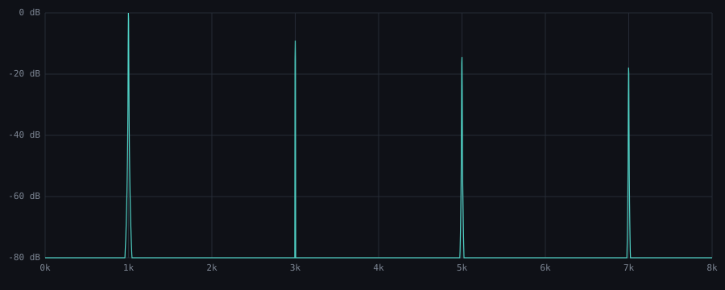

# DSP Measurements

Reproducible measurements of flagship kernels, generated by
`cargo run --release --example dsp_report -p sonido-effects`. Signals are
analysed with the in-repo `sonido-analysis` FFT/THD/RT60 tooling — no external
tools, no hand-tuned numbers.

Test conditions: 48000 Hz sample rate, 16384-point FFT, Blackman–Harris window.

## Distortion — THD vs drive (1 kHz)

| Drive (dB) | THD (%) | THD (dB) | THD+N (%) |
|-----------:|--------:|---------:|----------:|
|         10 |   13.19 |    -17.6 |    105.01 |
|         20 |   33.37 |     -9.5 |    113.73 |
|         30 |   41.43 |     -7.7 |    120.08 |
|         40 |   43.20 |     -7.3 |    122.85 |

## Distortion — harmonic structure (30 dB drive, 1 kHz)

Amplitude of each harmonic relative to the fundamental:

| Harmonic | Freq (Hz) | Level (dB) |
|---------:|----------:|-----------:|
|        1 |      1000 |        0.0 |
|        2 |      2000 |     -114.9 |
|        3 |      3000 |       -9.6 |
|        4 |      4000 |     -114.2 |
|        5 |      5000 |      -14.5 |
|        6 |      6000 |     -115.9 |
|        7 |      7000 |      -17.8 |
|        8 |      8000 |     -118.4 |

Kernels run at base rate here; the desktop/plugin path wraps each kernel in
`Oversampled<N>` (`crates/sonido-core/src/oversample.rs`, windowed-sinc up/downsampling)
to keep these harmonics from aliasing back into the audible band.

## Reverb — measured decay (Schroeder RT60)

| Metric | Value (s) |
|--------|----------:|
| RT60 | 3.50 |
| EDT (early decay) | 0.42 |
| T30 | 1.75 |
| Fit correlation | 0.998 |

## Distortion — output spectrum

*1 kHz fundamental at 30 dB drive; harmonic series visible at integer multiples.*
